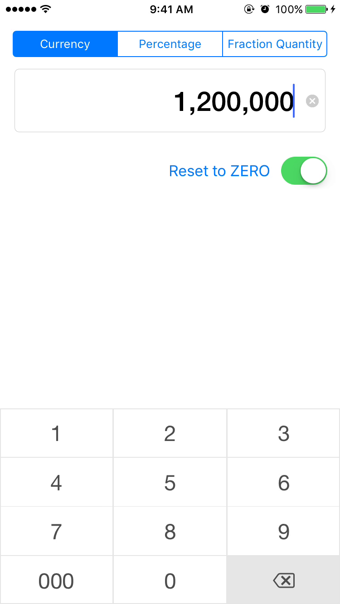

## What this contributions have
The new `KVAmountInputTextField` is inspired from `LEAmountInputTextField`
 >`LEAmountInputView` is an amount input view inspired by Square's design.

[Demo](https://appetize.io/app/fjq0kmdk0bkkzx22a52p3qpxj0)

# LEAmountInputView
Please checkout [LEAmountInputView][5023bfdb]

  [5023bfdb]: https://github.com/efremidze/LEAmountInputView "LEAmountInputView"
